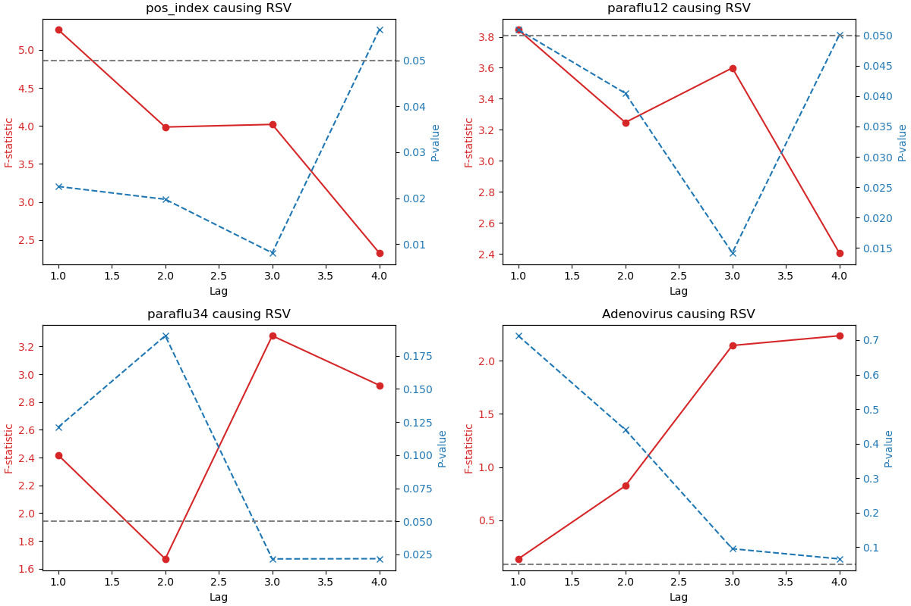
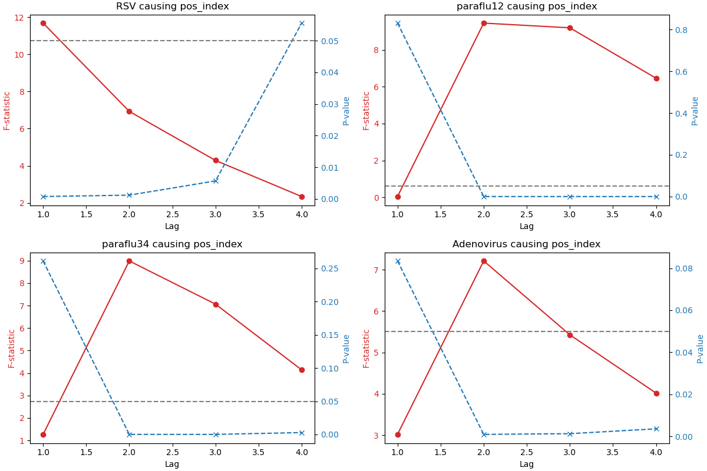
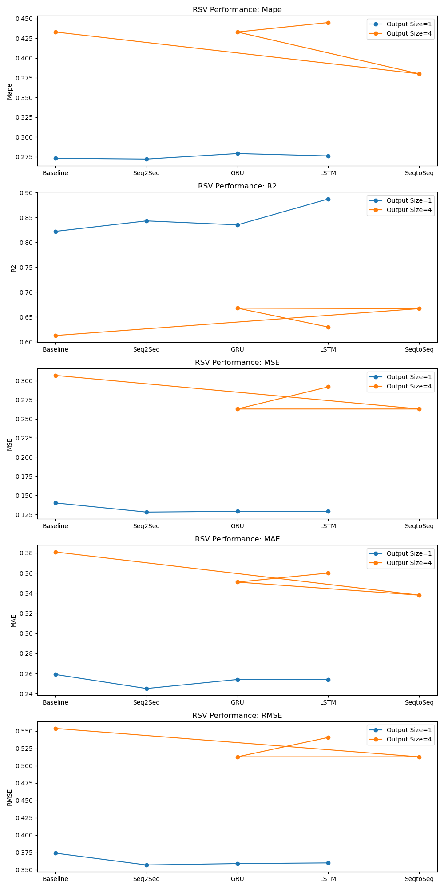
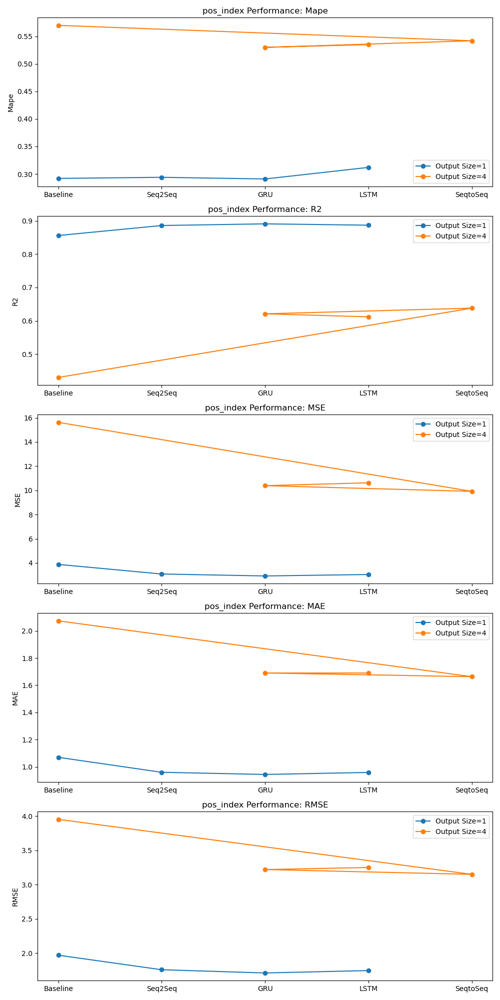

## March 26
### Granger Causality
#### pos_index vs Adenovirus
F-statistic (blue line): this line shows the F-statistic of Granger causality of Adenovirus on pos_index at different lag orders. the higher the F-statistic, the stronger the evidence for the rejection of the original hypothesis (i.e., the hypothesis that Adenovirus is not a Granger cause of pos_index).
P-value (red line): this line shows the corresponding p-value, i.e. the probability of obtaining such or more extreme F-statistics at each lag order. Usually, a p-value is considered statistically significant if it is below a certain threshold (e.g., 0.05 or 0.01). In this figure, it appears that the p-value is below the standard line of 0.05 at certain lag orders (dashed line), which suggests that Adenovirus is the Granger cause of pos_index at these lag orders.
Lag order (horizontal axis): the horizontal axis represents different lag orders. The lag order indicates how many previous periods of data are considered to predict the current value of pos_index in the Granger causality test.

### RSV

Historical information on Adenovirus has statistically significant predictive value for RSV at lag 2
### pos_index

Historical information on Adenovirus has statistically significant predictive value for pos_index at lag 2

### Base Model perform
#### RSV
| model      | input_size | output_size | Mape |       R2           | MSE        | MAE        |RMSE       |
| ----------- | ----------- |----------- |----------- |----------- |----------- |----------- |----------- |
| Baseline      | 6       | 1            | 0.273      |0.822       |0.140       |0.259        |0.374
| Seq2Seq   | 6        | 1             |0.272           |0.843     |0.128        |0.245       |0.357
|GRU | 6        | 1             | 0.279            |0.835            |0.129        |0.254      |0.359
|LSTM | 6        | 1             | 0.276            |0.887          |0.129        |0.254       | 0.360
| Baseline      | 6       | 4            | 0.433      |0.613       |0.307       |0.381        |0.554
| SeqtoSeq      | 6       | 4            | 0.380      |0.667       |0.263       |0.338        |0.513
|GRU | 6        | 4             | 0.433           |0.668            |0.263      |0.351        |0.513 
|LSTM | 6        | 4             | 0.445           |0.630            |0.292     |0.360        |0.541

#### pos_index
| model      | input_size | output_size | Mape        | R2         | MSE        | MAE        |RMSE|
| ----------- | ----------- |----------- |----------- |----------- |----------- |----------- |----------- |
| Baseline      | 6       | 1            | 0.292      |0.856       |3.884      |1.07         |1.970
| Seq2Seq   | 6        | 1             |0.294           |0.886     |3.091      |0.96         |1.758
|GRU | 6        | 1             | 0.291            |0.891         |2.929       |0.944        |1.711
|LSTM | 6        | 1             | 0.312            |0.887            |3.05    |0.959        |1.746
| Baseline      | 6       | 4    | 0.570      |0.430       |15.622921  |2.0734224|           |3.9525
| SeqtoSeq      | 6       | 4            | 0.542      |0.638       |9.92       |1.663        |3.15
|GRU | 6        | 4             | 0.530            |0.621            |10.39     |1.69        |3.22  
|LSTM | 6        | 4             | 0.535            |0.612            |10.627  |1.69         |3.25

Both in predicting pos_index and RSV, the Seq2Seq model performs best overall in the Output Size=1 configuration.

